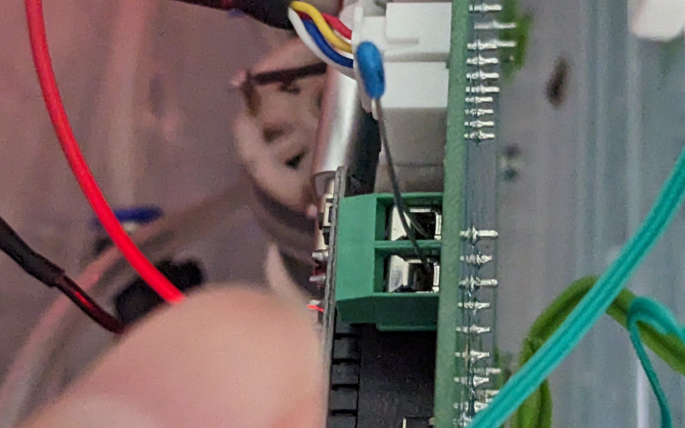
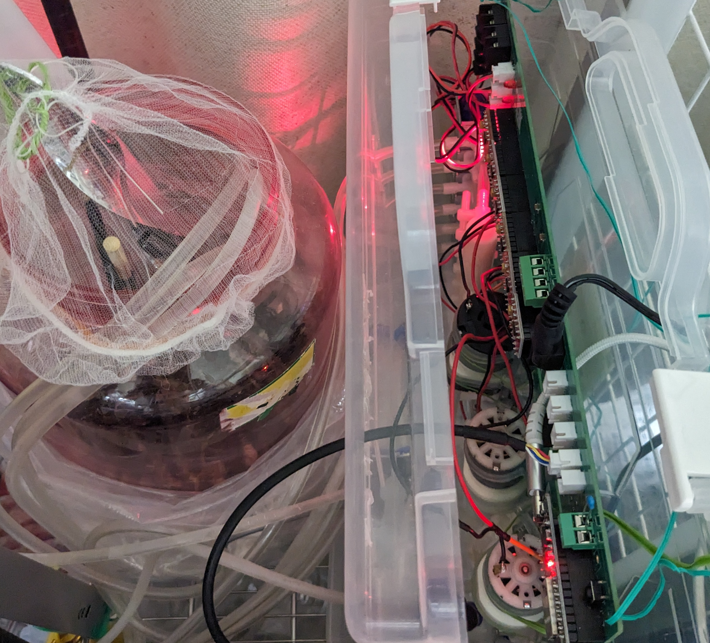

<div class="page"/>

# アブストラクション
秘密結社オープンフォースでの総統(@nanbuwks)指揮による今までの活動として、

宇宙栽培試行のための閉鎖空間内豆苗栽培と栽培ロボット運用記 (https://github.com/busyoucow/SpaceToumyou) では、人間の手による管理で豆苗を水耕栽培を行い、

宇宙栽培試行のための栽培ロボット起動及び構造物と配管組み上げ記録 (https://github.com/busyoucow/SpaceRobotFarmTest01) では、総統より供与された栽培ロボットの組み立て及び動作確認を行った。

そして実際に食用植物を総統提供の栽培ロボット (https://qiita.com/nanbuwks/items/37bffef16036937eecc3) を使用して実際に育成しその経過観察を行い
一定の結果(https://github.com/busyoucow/SpaceToumyouRobot)をみた。

今回は上記栽培ロボットに温度計測機能を付加し実働を試みていく。

# はじめに
自宅も夏を迎え、節約のために不在時冷房を控えていたせいか発芽した芽も枯れてしまった。

早すぎる初夏の暑さで暑熱順化する時期が過ぎ、日本各地で線状降水帯が猛威を振るい始めていた頃…秘密結社オープンフォースの総統から指示があった。

「温度計測機能をつけてみませんか？」

私はESP32を使って総統の指示のもと毎朝プログラミング実習をしていた記憶を必死で思い出していた…

# 何故温度計測をするのか
昨今の夏を中心とした高温状態の継続（直近では関東地方は秋雨前線のせいで気温低下したが）を鑑みて室温上昇による栽培環境の高温化を緩和できないか考えた。

この夏は既に何度か、高温によるとみられる植物苗の枯死が出現しているためである。


現在の主な栽培瓶は水の供給時ににミストノズルを使用しているため、水ミストを連続供給して気化熱により栽培瓶の環境内温度を低下することを期待した。

本来は栽培瓶内部に温度計測器を挿入すべきであるが、今回は温度計測器による温度計測とそれを検知して水供給ポンプを動作させることを目指した。

# 温度計測に使うもの
温度計測には温度計測器として、温度センサー基板やそれが統合された環境センサーを使うことをIoTが一般化した現在では考えられる。

しかし、今回はそれを使わない方法…サーミスタを使用することとする。

理由は以下に示す
- 費用の圧縮

実際の栽培環境では複数の温度計測器を使用する予定である。できるだけ安価にできることは重要な要素となる。

- 使用部材の一般化

使用部材が製造側の都合で廃番になった場合対応に苦慮する事となる。一般的な部材であるサーミスタを使用することでリスク回避を期待する。

…しかしこれが、後に理数系大勉強会につながることを私は予想していなかった。

## そもそもサーミスタとは？




指で指している緑のコネクタに刺さっている青い小さな部品がサーミスタである。
サーミスタとは温度変化により抵抗値が変わる抵抗器である。

参考：
【初めてのArduino】6.サーミスタ｜ハンズオンで学ぶ初心者向け入門コース

https://start-electronics.com/electronics/first-arduino/thermistor/

このサーミスタを使うために、私は中学数学からやり直すこととなる…


# 理数系大勉強会の始まり
まさかこの歳で数学を学ぶとは思わなかったが、意外と忘れているものである。
分数の計算などは一般社会で通常使うことは少ないであろう。
しかし上記の通りサーミスタを使用する時は大いに使用するものである。

こちらの記事を参考にした。

IoTピザ窯、または巨大災害レジリエンスで娘に怒られたこと

https://qiita.com/nanbuwks/items/0bb92acf7f7ee075a6b5#%E3%82%B5%E3%83%BC%E3%83%9F%E3%82%B9%E3%82%BF

上記記事のサーミスタの項にあるが、サーミスタが出力するのは抵抗値でありそこから計算により温度を求めなくてはいけない。
その公式は分数となるため中学数学からやり直す事となったのである。

その際には毎朝勉強朝活して頂いた秘密結社オープンフォース総統や適宜アドバイスを頂いた秋葉原ロボット部メンバーに大いに助けられた。ここで感謝したい。

完成した計算式は下記の実機コードにて示す。
計算式は

 ` // サーミスタを参照する `

の場所にある。注釈行は計算を試行錯誤した跡であるためあえて残した。

# 実機コード

今回のコードは栽培ロボット6ch版向けであり以下の動作をするものとする

- ポンプ1は給水ポンプ
- ポンプ2は排水ポンプ
- ポンプ3はエアーポンプであるが現在は使用していない
- バルブ1は栽培対象1に給水
- バルブ2は栽培対象2に給水
- バルブ3は栽培対象3に給水
- バルブ4は栽培対象1に排水
- バルブ5は栽培対象2に排水
- バルブ6は栽培対象3に排水
- センサ1は検出したら栽培対象1に排水
- タクトスイッチを押したらポンプ1～3とバルブ1～6を動作する
（押さなくても電源ON時に一回行う）
- 電源ON時に全ての出力をONにしてすぐOFFし稼働チェックを行う
- サーミスタを参照し温度が33度を超えたら水循環を行う
- バルブ4は栽培対象1に排水
- バルブ5は栽培対象2に排水
- バルブ6は栽培対象3に排水
- バルブ1は栽培対象1に給水
- バルブ2は栽培対象2に給水
- バルブ3は栽培対象3に給水
- 一度行ったら10分間行わない

実際のコードを一部抜粋する。

```arduinoIDE 実機コード

#define TACT_SW 36
#define SENSOR_W1 34
#define PUMP03 4
#define BUZZER01 2

#define  VP 36


int tact01 = 1;
int valve01 = 0;

float SetTempUp = 33;
int TempTimeIdolMin = 10;
int IdolTimeMin = 0;

int nvp = 0;
int kvp = 0;

  pinMode(SENSOR_W1, INPUT);
  pinMode(TACT_SW, INPUT);


// メインルーチン
void loop(){


  float volta = 0;
  float oum = 0;
  float baseTemp;
  float t1;
  const float BETA = 3950;

  // タクトスイッチ状態取得
  tact01 = digitalRead(TACT_SW);   
  tact02 = digitalRead(SENSOR_W1);   

// サーミスタを参照する  
  nvp = analogRead(VP);
  if (nvp != kvp ) {
  
    volta = (nvp * 3.3) / 4095.0;
//    oum =  (10000 / (nvp + 10000)) * volta ;
//    oum = ((volta / 3.3) - 1) * 10000;  
      oum = (volta / (3.3 - volta)) * 10000;
      t1 = log(oum / 10000);
      baseTemp = ((298*BETA) / ( BETA + ( 298 * t1 ))) - 273;

    Serial.print( "VP = " );
    Serial.print( nvp );
    Serial.print( "/ voltage = " );
    Serial.print( volta );
    Serial.print( "V / oum = " );
    Serial.print( oum );
    Serial.print( "Ω / temp = " );
    Serial.print( baseTemp );
    Serial.println( "C " );

// 現在温度が設定温度を超えたら
    if (baseTemp >= SetTempUp ){
      Serial.println( "SetTemp Over");

// 水の循環を行う
// 水の循環を行うのは10分に一回のみとする
      if (IdolTimeMin == 0){
        IdolTimeMin = TempTimeIdolMin;
        Serial.print( IdolTimeMin );
        Serial.println( " MinIdol " );
      }
    }

  }
  kvp = nvp;


// 温度変化による水循環から10分経過したらフラグ解除する
  if (IdolTimeMin > 0) {
    IdolTimeMin = IdolTimeMin - 1 ;
    Serial.print( IdolTimeMin );
    Serial.println( " MinIdol " );
  }

}

```
# 動作結果




実機に書き込んだが時刻を取るための無線LANが調子が悪かったため後日再度挑戦する。
ちなみに写真右が栽培ロボット基板。左が栽培瓶であり給排水濾過瓶がラックの下にある。


# おわりに
今回はトラブルにより動作しなかったが、今後は動作するよう活動を進めていく。
そして今後も引き続き機能追加を試みるものとする。
